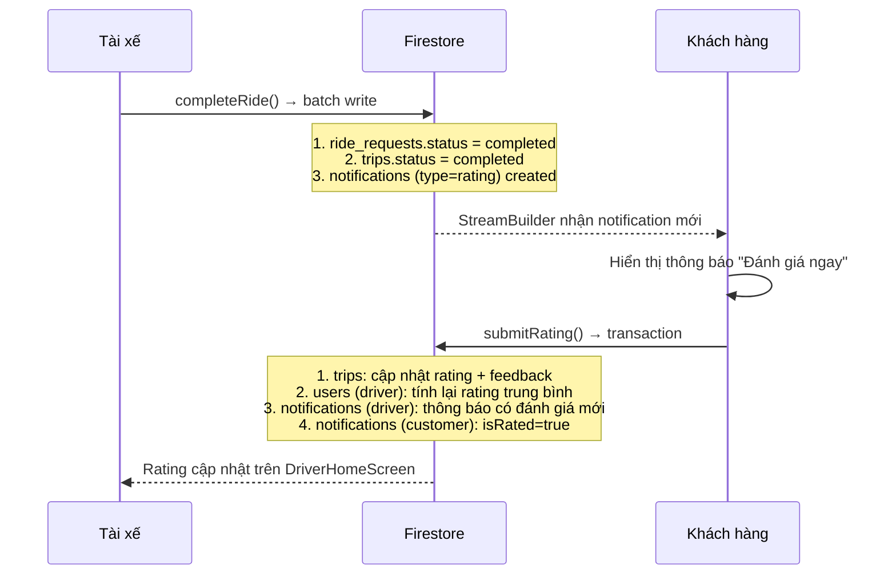

# 🔍 Phân Tích Chức Năng Đánh Giá Tài Xế

## Tổng Quan Flow

---

## Kết Quả Kiểm Tra Từng Thành Phần

### ✅ 1. Model Layer — OK
| File | Trạng thái | Ghi chú |
|------|-----------|---------|
| [notification_model.dart](file:///e:/hoc_lap_trinh/laptrinhungdungdidong/ride_now_khoaluan/lib/models/notification_model.dart) | ✅ OK | Có `NotificationType.rating`, fields `isRated`, `driverId`, `driverName` |
| [trip_model.dart](file:///e:/hoc_lap_trinh/laptrinhungdungdidong/ride_now_khoaluan/lib/models/trip_model.dart) | ✅ OK | Có fields `rating` (double?) và `feedback` (String?) |
| [user_model.dart](file:///e:/hoc_lap_trinh/laptrinhungdungdidong/ride_now_khoaluan/lib/models/user_model.dart) | ✅ OK | Có `rating`, `ratingCount`, `earnings`, `totalTrips` + `copyWith` |

---

### ✅ 2. Repository Layer — OK (completeRide + submitRating)

#### [ride_repository.dart](file:///e:/hoc_lap_trinh/laptrinhungdungdidong/ride_now_khoaluan/lib/repositories/ride_repository.dart)

**`completeRide()` (dòng 273-317):** ✅ Sử dụng `WriteBatch` → atomic:
- Cập nhật `ride_requests` status = completed
- Cập nhật `trips` (ongoing → completed)  
- Tạo notification `type: 'rating'` với `isRated: false` cho customer

**`submitRating()` (dòng 320-391):** ✅ Sử dụng `runTransaction` → atomic:
- Cập nhật `trips` với rating + feedback
- Tính rating trung bình mới: `((cũ × số_lượng_cũ) + mới) / số_lượng_mới`
- Gửi notification info cho tài xế
- Đánh dấu notification customer `isRated: true`

---

### ✅ 3. Service Layer — OK

#### [notification_service.dart](file:///e:/hoc_lap_trinh/laptrinhungdungdidong/ride_now_khoaluan/lib/services/notification_service.dart)
- `watchNotifications(userId)`: Stream realtime, sắp xếp theo `createdAt` giảm dần ✅
- `markAsRead()`, `markAsRated()`: Có đủ ✅
- `createRatingNotification()`: Helper method (hiện tại không sử dụng vì `completeRide` đã tự tạo inline) — Không lỗi, chỉ redundant

---

### ✅ 4. UI Layer — OK

#### [notification_view.dart](file:///e:/hoc_lap_trinh/laptrinhungdungdidong/ride_now_khoaluan/lib/views/main/notifications/notification_view.dart)
- `Obx` + `StreamBuilder` bọc đúng → reactive khi có notification mới ✅
- Nút "Đánh giá ngay" → `_showRatingDialog()` chỉ khi `!notif.isRated` ✅
- Sau khi đã đánh giá → nút disable "Đã đánh giá" ✅
- Check `notif.driverId == null` trước khi mở dialog ✅

#### [rating_dialog.dart](file:///e:/hoc_lap_trinh/laptrinhungdungdidong/ride_now_khoaluan/lib/views/main/notifications/widgets/rating_dialog.dart)
- UI: 5 sao, text feedback, nút "Gửi đánh giá" ✅
- Gọi `_rideRepository.submitRating()` với đầy đủ params ✅
- Loading state + error handling ✅
- `Get.back()` + snackbar thành công ✅

#### [driver_home_view.dart](file:///e:/hoc_lap_trinh/laptrinhungdungdidong/ride_now_khoaluan/lib/views/main/home/driver_home_view.dart)
- Hiển thị `user.rating` trong stat card `RATING` (dòng 267-269) ✅
- Sử dụng `Obx` → tự cập nhật khi Firestore thay đổi ✅

#### [trip_history_card.dart](file:///e:/hoc_lap_trinh/laptrinhungdungdidong/ride_now_khoaluan/lib/views/widgets/trip_history_card.dart)
- Hiển thị `trip.rating` kèm icon ⭐ trong footer (dòng 121-124) ✅

---

## ⚠️ Các Vấn Đề Tiềm Ẩn Cần Lưu Ý

### 1. `createRatingNotification()` trong NotificationService bị dư thừa
- `completeRide()` trong `RideRepository` đã trực tiếp tạo notification bằng batch write (dòng 301-314)
- `NotificationService.createRatingNotification()` (dòng 52-71) không được gọi ở đâu cả
- **Mức độ:** Thấp — không gây lỗi, chỉ là dead code

### 2. Không có Firestore Security Rules check
- `submitRating` cho phép bất kỳ user nào gửi rating (không kiểm tra `customerId` match với user đang login)
- **Mức độ:** Trung bình — nên thêm check ở server-side (Firestore Rules) hoặc trong transaction

### 3. Edge Case: Đánh giá trùng lặp
- Nếu 2 tab/device cùng mở notification, user có thể submit rating 2 lần trước khi `isRated` được set
- Transaction chỉ check driver rating, KHÔNG check `isRated` trước khi ghi
- **Mức độ:** Thấp — ít khi xảy ra trong thực tế

### 4. Timestamp sử dụng client-side `DateTime.now()`
- `completeRide()` dòng 313: `Timestamp.fromDate(DateTime.now())`
- Nên dùng `FieldValue.serverTimestamp()` để đảm bảo chính xác
- **Mức độ:** Thấp — chấp nhận được cho luận văn

---

## ✅ Kết Luận

> **Chức năng đánh giá tài xế hoạt động đúng và đầy đủ.** Toàn bộ flow từ hoàn thành chuyến → thông báo → đánh giá → cập nhật rating tài xế đều được implement chính xác với xử lý atomic (batch/transaction). Không phát hiện bug nào gây lỗi runtime.

Các vấn đề tiềm ẩn nêu trên đều ở mức **thấp** và **không ảnh hưởng đến chức năng chính** của hệ thống.
